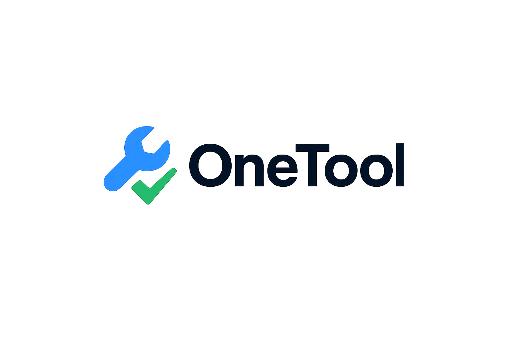

# OneTool

<div align="center">
  
</div>

## Overview

OneTool is a lightweight, modern alternative to Jobber for small field-service businesses (cleaning, landscaping, HVAC, trades). The product focuses on **clarity, speed, and essential workflows** without the bloat. MVP delivers: client & project tracking, quoting (with PDF + e-signature), task scheduling, invoicing & payments, notifications, and a concise insights dashboard.

### Key Features

- **Client Management**: Create, track, and manage client relationships with consent flags
- **Project Tracking**: Link projects to clients with status tracking and task management
- **Quote Management**: Create professional quotes with line items, PDF generation, and e-signature
- **Task Scheduling**: Schedule and track tasks with reminders and calendar integration
- **Invoice & Payments**: Generate invoices from quotes with Stripe payment integration
- **Real-time Dashboard**: Key metrics and insights for business performance
- **Multi-tenant Architecture**: Organization-scoped data with Clerk authentication

## Tech Stack

- **Frontend**: Next.js 15.5 (App Router, Turbopack), Tailwind CSS v4, shadcn/ui components
- **Backend**: Convex (real-time database and functions)
- **Authentication**: Clerk (auth + organizations + Stripe billing)
- **Payments**: Stripe Checkout + Webhooks
- **Email**: Resend
- **SMS**: Twilio (basic reminders)
- **Analytics**: PostHog
- **Hosting**: Vercel (web), Convex Cloud (backend)

## Getting Started

### Prerequisites

- Node.js 18+
- pnpm (recommended) or npm/yarn
- Convex account and deployment
- Clerk account for authentication

### Installation

1. Clone the repository:

```bash
git clone <repository-url>
cd nextjs-onetool
```

2. Install dependencies:

```bash
pnpm install
```

3. Set up environment variables in `.env.local`:

```bash
# Convex
CONVEX_DEPLOYMENT=your-convex-deployment
NEXT_PUBLIC_CONVEX_URL=your-convex-url

# Clerk (when implemented)
# NEXT_PUBLIC_CLERK_PUBLISHABLE_KEY=your-clerk-key
# CLERK_SECRET_KEY=your-clerk-secret

# Add other service keys as needed
```

4. Run the development server:

```bash
pnpm dev
```

5. Start Convex development server in a separate terminal:

```bash
npx convex dev
```

Open [http://localhost:3000](http://localhost:3000) with your browser to see the result.

## Project Structure

```
├── src/
│   ├── app/                 # Next.js App Router pages
│   ├── components/          # React components
│   │   ├── ui/             # shadcn/ui components
│   │   └── ...             # Custom components
│   ├── lib/                # Utilities and configurations
│   ├── hooks/              # Custom React hooks
│   ├── providers/          # Context providers
│   └── env.ts              # Environment variables
├── convex/                 # Convex backend functions and schema
├── public/                 # Static assets
└── CLAUDE.md              # Development guidance
```

## Development Commands

```bash
# Install dependencies
pnpm install

# Run development server with Turbopack
pnpm dev

# Build for production with Turbopack
pnpm build

# Start production server
pnpm start

# Run linter
pnpm lint

# Run tests in watch mode (for development)
pnpm test

# Run tests once (for CI)
pnpm test:once

# Run tests with debugging
pnpm test:debug

# Generate test coverage report
pnpm test:coverage

# Convex development (run in separate terminal)
npx convex dev
```

## Roadmap

This project follows a 6-week MVP timeline:

- **Week 1**: Project setup, authentication, basic UI ✅
- **Week 2**: Organization setup, client management
- **Week 3**: Projects, tasks, and scheduling
- **Week 4**: Quotes with PDF generation and e-signature
- **Week 5**: Invoices and Stripe payment integration
- **Week 6**: Dashboard, notifications, and final polish

## Testing

OneTool uses [Vitest](https://vitest.dev/) with [convex-test](https://www.npmjs.com/package/convex-test) for comprehensive backend testing.

### Test Coverage

Our test suite covers critical business logic with over 2,400 lines of tests across 49 passing tests:

- ✅ **Tasks** (`convex/tasks.test.ts`) - 942 lines, 16 tests

  - Task creation with validation (empty titles, time format)
  - Recurring task generation and scheduling
  - List filtering (status, client, date range)
  - Update, complete, and delete operations
  - Statistics calculation

- ✅ **Clients** (`convex/clients.test.ts`) - 650+ lines, 14 tests

  - Client CRUD operations
  - Bulk creation with error handling
  - Archive and restore functionality
  - Status filtering and search
  - Client statistics and metrics
  - Project count aggregation

- ✅ **Auth Helpers** (`convex/lib/auth.test.ts`) - 400+ lines, 15 tests

  - Organization membership validation
  - User authentication helpers
  - getCurrentUserOrgId with various auth states
  - Organization access validation
  - Alternative org ID field handling

- ✅ **Quotes** (`convex/quotes.test.ts`) - 450+ lines, 4 tests
  - Sequential quote number generation
  - Status filtering
  - Client-based filtering

### Coverage Goals

- **Mutations**: 80%+ coverage (critical business logic)
- **Queries**: 70%+ coverage (data retrieval)
- **Auth/Utils**: 90%+ coverage (security-critical functions)

### Running Tests

```bash
# Watch mode - runs tests on file changes (great for TDD)
pnpm test

# Single run - for CI/CD pipelines
pnpm test:once

# Debug mode - attach debugger for troubleshooting
pnpm test:debug

# Coverage report - see what's tested and what's not
pnpm test:coverage
```

### Test Structure

Tests are co-located with the code they test in the `convex/` directory:

```
convex/
├── tasks.ts              # Implementation
├── tasks.test.ts         # Tests
├── clients.ts
├── clients.test.ts
├── quotes.ts
├── quotes.test.ts
└── lib/
    ├── auth.ts
    └── auth.test.ts
```

### Writing Tests

Our tests use the `convex-test` library to create a mock Convex environment:

```typescript
import { convexTest } from "convex-test";
import { describe, it, expect } from "vitest";
import { api } from "./_generated/api";

describe("myFunction", () => {
	it("should do something", async () => {
		const t = convexTest(schema, modules);

		// Run a mutation
		await t.mutation(api.module.create, {
			name: "Test",
		});

		// Query and assert
		const results = await t.query(api.module.list);
		expect(results).toHaveLength(1);
	});
});
```

### Test Patterns

1. **Permission Testing**: Verify member vs admin access controls
2. **Validation Testing**: Ensure proper error handling for invalid inputs
3. **Edge Cases**: Test boundary conditions (empty strings, negative numbers, etc.)
4. **Organization Isolation**: Confirm data scoping per organization
5. **Financial Calculations**: Validate money math with precision
6. **Sequential Operations**: Test number generation and ordering

### Continuous Integration

Tests run automatically on:

- Pull requests to `main`, `staging`, or `develop` branches
- Pushes to protected branches
- Manual workflow dispatch

See `.github/workflows/test.yml` for the complete CI configuration.

### Contributing Tests

When adding new features:

1. **Write tests first** (TDD approach recommended)
2. **Cover happy paths** - typical user flows
3. **Test error cases** - invalid inputs, missing data
4. **Test permissions** - member vs admin access
5. **Test organization isolation** - data shouldn't leak between orgs
6. **Aim for coverage goals** - 80%+ for mutations, 70%+ for queries

Example contribution workflow:

```bash
# 1. Create feature branch
git checkout -b feature/new-feature

# 2. Write failing tests
# Edit: convex/myFeature.test.ts

# 3. Run tests in watch mode
pnpm test

# 4. Implement feature until tests pass
# Edit: convex/myFeature.ts

# 5. Check coverage
pnpm test:coverage

# 6. Commit and push
git add convex/myFeature.ts convex/myFeature.test.ts
git commit -m "feat: add new feature with tests"
git push origin feature/new-feature
```

## Contributing

1. Check the [TODO.md](TODO.md) for current development tasks
2. Review the [PRD.md](PRD.md) for detailed requirements
3. Follow the development guidelines in [CLAUDE.md](CLAUDE.md)
4. Create feature branches and submit pull requests

## License

This project is private and proprietary to OneTool.
